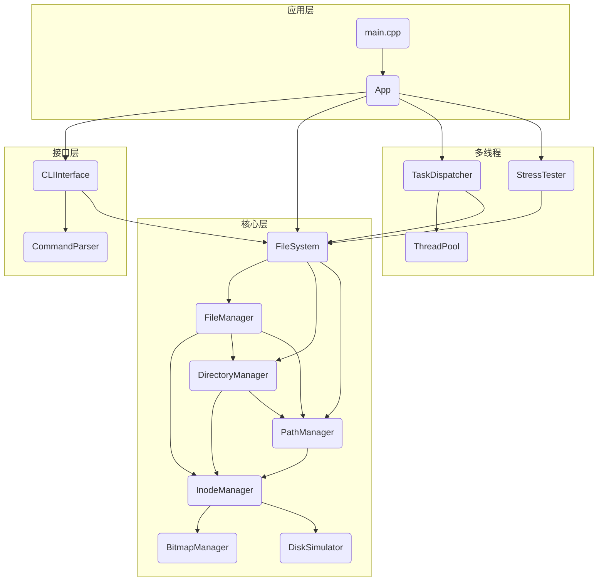
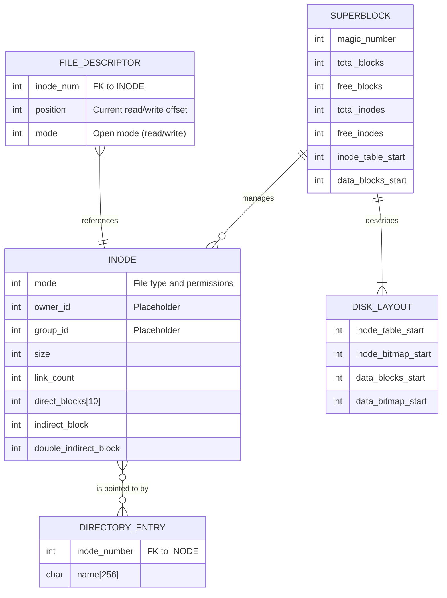
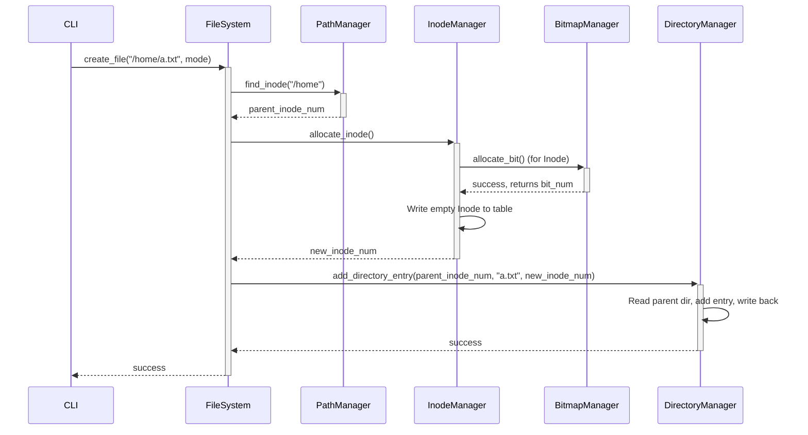
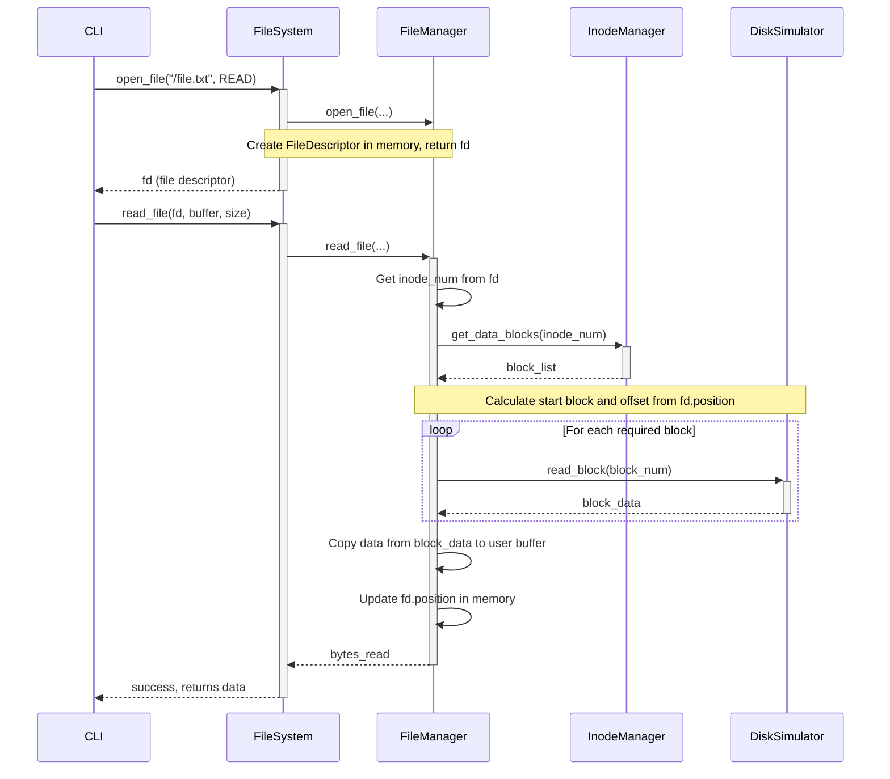
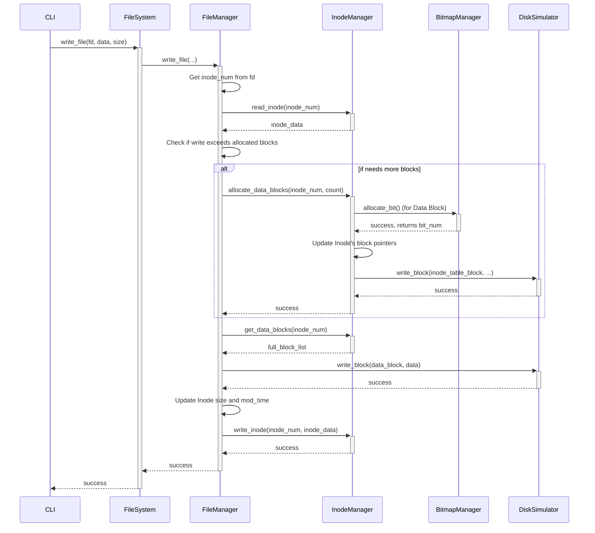
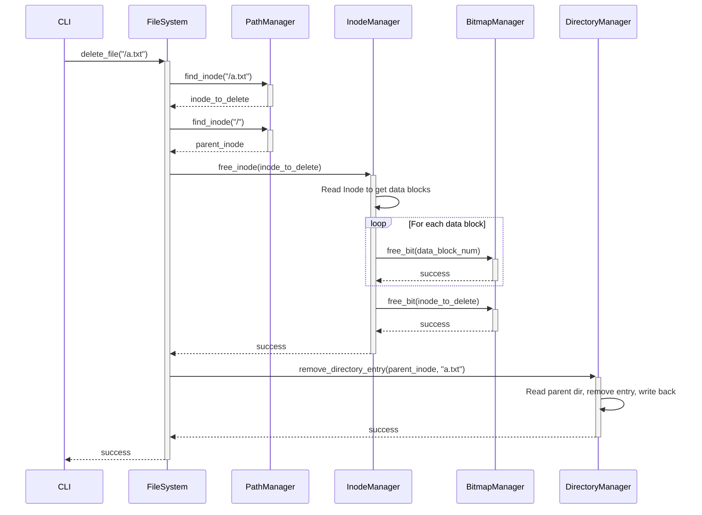
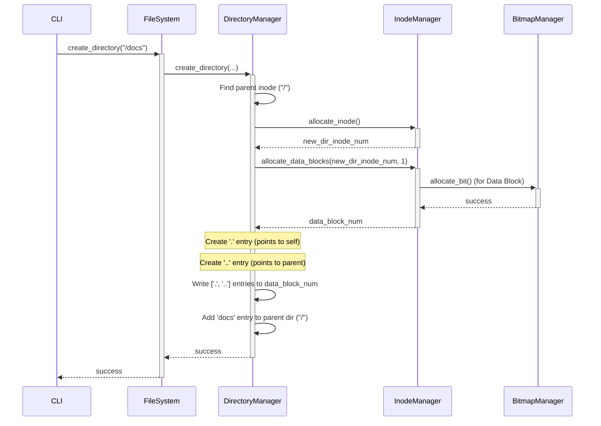

# Linux高级编程设计文档

## 1. 引言

### 1.1. 文档目的

本文档旨在为模拟文件系统项目提供一个全面而深入的技术性描述。其主要目的包括：

* **阐明系统架构**：清晰地定义系统的模块化结构，展示各组件之间的关系和交互方式。
* **详解核心设计**：深入剖析核心数据结构（如 Inode、Superblock）和关键算法的设计与实现。
* **描绘工作流程**：通过图表（Mermaid）直观地展示主要操作（如文件创建、读取）的内部执行流程。
* **作为开发与维护指南**：为未来的开发、维护和代码审查工作提供一份权威的技术参考。

### 1.2. 项目概述

本项目是一个用 C++ 实现的模拟文件系统，旨在模仿现代操作系统中文件系统的核心功能。它在单个虚拟磁盘文件（disk file）上构建了一个完整的、具备层级结构的文件系统。

主要功能包括：

* **磁盘管理**：支持创建指定大小的虚拟磁盘文件并对其进行格式化。
* **文件与目录操作**：提供了一套类似 POSIX 的标准接口，支持文件的创建（`touch`）、删除（`rm`）、读（`cat`）、写（`echo`），以及目录的创建（`mkdir`）、删除（`rm`）、列出（`ls`）等。
* **命令行接口 (CLI)**：内置一个交互式 shell，方便用户直接与文件系统进行交互。
* **多线程与并发支持**：项目包含一个复杂的多线程框架。它不仅提供了一个 `stress` 命令来执行高强度的并发读写压力测试，还提供了一个 `multithreaded` 命令模式，允许用户将多个操作（以分号分隔）提交给线程池并发执行，以测试和利用系统的线程安全特性。

整个项目代码结构清晰，分为硬件模拟、核心逻辑、命令行接口和工具类等多个层次，体现了良好的软件工程实践。

## 2. 使用指南

本指南提供了如何构建、运行和使用此磁盘模拟器的说明。

### 2.1. 构建说明

本项目使用 `make` 来构建和管理。以下是主要命令：

* **`make` 或 `make all`**: 编译源代码并在根目录创建 `disk_sim` 可执行文件。
* **`make clean`**: 删除所有构建产物，包括可执行文件和目标文件。
* **`make test-functionality`**: 运行完整的功能测试脚本。
* **`make test-multithreaded`**: 运行多线程命令执行的测试。
* **`make test-thread-safety`**: 运行测试以验证文件系统的线程安全性。
* **`make stress-test`**: 对文件系统运行可配置的压力测试。
* **`make help`**: 显示包含所有可用 `make` 目标的帮助信息。

### 2.2. 快速上手

在使用文件系统之前，您需要创建并格式化一个虚拟磁盘文件。

#### 2.2.1. 创建磁盘

要创建新的虚拟磁盘，请使用 `create` 命令。

```shell
./disk_sim <disk_file> create <size_mb>
```

* `<disk_file>`: 您要创建的磁盘文件的路径 (例如, `my_disk.img`)。
* `<size_mb>`: 磁盘大小（以MB为单位）。

**示例:**

```shell
./disk_sim my_disk.img create 100
```

这将创建一个名为 `my_disk.img` 的100MB磁盘文件。

#### 2.2.2. 格式化磁盘

创建磁盘后，您必须在使用前对其进行格式化。

```shell
./disk_sim <disk_file> format
```

**示例:**

```shell
./disk_sim my_disk.img format
```

### 2.3. 执行模式

该模拟器可以以多种模式运行。

#### 2.3.1. 交互模式

此模式会启动一个交互式shell，您可以在其中直接输入命令。

```shell
./disk_sim <disk_file> run
```

或

```shell
./disk_sim <disk_file>
```

您将看到 `disk-sim>` 提示符。输入 `help` 查看可用命令，输入 `exit` 退出。

#### 2.3.2. 单命令模式

您可以执行单个命令而无需进入交互式shell。

```shell
./disk_sim <disk_file> <command> [args...]
```

**示例:**

```shell
./disk_sim my_disk.img ls /
```

#### 2.3.3. 多线程模式

此模式允许您使用线程池并发执行多个命令。请使用分号 (`;`) 分隔命令。

```shell
./disk_sim <disk_file> multithreaded "<command1>; <command2>; ..."
```

您还可以指定要使用的线程数：

```shell
./disk_sim <disk_file> multithreaded --threads <num_threads> "<command1>; <command2>"
```

**示例:**

```shell
./disk_sim my_disk.img multithreaded "touch /a.txt; touch /b.txt"
```

### 2.4. 命令列表

以下是交互式shell中可用的命令列表：

* `help`: 显示帮助信息。
* `exit` 或 `quit`: 退出程序。
* `info`: 显示磁盘信息。
* `format`: 格式化磁盘。
* `ls [path]`: 列出目录内容。
* `mkdir <path>`: 创建目录。
* `touch <path>`: 创建空文件。
* `rm <path>`: 删除文件或目录。
* `cat <path>`: 显示文件内容。
* `echo <text> > <path>`: 将文本写入文件。
* `copy <src> <dst>`: 复制文件。
* `stress [options]`: 运行存储压力测试。

### 2.5. 压力测试

该模拟器包含一个强大的压力测试工具，用于评估高负载下的性能和正确性。

#### 2.5.1. 使用 `stress` 命令

您可以直接从命令行运行压力测试。

```shell
./disk_sim <disk_file> stress [options]
```

**选项:**

* `--duration <seconds>`: 测试持续时间。
* `--files <num_files>`: 测试中使用的文件数。
* `--threads <num_threads>`: 并发线程数。
* `--write-size <bytes>`: 每次写操作的大小。
* `--monitor <seconds>`: 打印指标的时间间隔。
* `--workspace <path>`: 测试使用的工作目录。
* `--cleanup`: 测试后清理工作区。

#### 2.5.2. 使用 `make stress-test`

`Makefile` 提供了一种使用可配置参数运行压力测试的便捷方法。

```shell
make stress-test [VAR=value]
```

**变量:**

* `STRESS_DISK`: 压力测试磁盘文件的路径。
* `STRESS_DISK_SIZE`: 磁盘大小（MB）。
* `STRESS_DURATION`: 测试持续时间（秒）。
* `STRESS_FILES`: 文件数。
* `STRESS_THREADS`: 线程数。
* `STRESS_WRITE_SIZE`: 写入大小（字节）。
* `STRESS_MONITOR`: 监控间隔（秒）。
* `STRESS_WORKSPACE`: 测试的工作区目录。

**示例:**

```shell
make stress-test STRESS_DURATION=60 STRESS_FILES=16 STRESS_THREADS=8 STRESS_WRITE_SIZE=2048 STRESS_MONITOR=5 STRESS_DISK_SIZE=64 STRESS_WORKSPACE=/stress_ci
```

## 3. 系统架构设计

### 3.1. 模块化结构

系统被精心设计为四个主要的逻辑层次/模块，以实现高度的内聚和松散的耦合：

1. **应用层 (Application Layer)**
   * **`App`**: 应用程序的入口和主控制器。负责解析命令行参数，并根据指令（如 `create`, `format`, `run`）调度相应的功能。
   * **`main.cpp`**: 程序的唯一入口点，实例化并运行 `App` 类。

2. **接口层 (Interface Layer)**
   * **`CLIInterface`**: 实现了用户交互的命令行界面。它接收用户输入，调用解析器，并执行对应的文件系统命令。
   * **`CommandParser`**: 负责解析来自 `CLIInterface` 的原始命令字符串，将其转换为结构化的 `Command` 对象。

3. **核心层 (Core Layer)**
   * **`FileSystem`**: 这是文件系统的核心门面（Facade）。它为上层（如 `CLIInterface`）提供了统一、简洁的API，并封装了所有底层文件系统操作的复杂性。
   * **`FileManager`**, **`DirectoryManager`**: 分别处理文件和目录的特定逻辑，如创建、删除、读写等。
   * **`PathManager`**: 负责路径解析和inode查找，将字符串路径（如 `/home/user/file.txt`）转换为文件系统内部的inode编号。
   * **`InodeManager`**: 管理inode的生命周期，包括分配、释放、读写inode表。它还负责管理inode与数据块之间的映射关系。
   * **`BitmapManager`**: 一个通用的位图管理器，用于跟踪inode和数据块的分配状态（空闲或已用）。
   * **`DiskSimulator`**: 最底层的硬件模拟层。它通过读写一个本地文件来模拟一个块设备的I/O操作。

4. **多线程与工具层 (Threading & Utils)**
   * **`threading`**: 包含一套为并发测试设计的组件。`ThreadPool` 管理一组工作线程，`TaskDispatcher` 负责将命令分发给线程池执行，`StressTester` 则利用此框架进行高强度的压力测试。
   * **`utils`**: 包含一系列无状态的工具类和通用数据结构，如 `PathUtils` (路径字符串处理), `BlockUtils` (块计算), `ErrorHandler` (错误处理) 以及在 `common.h` 中定义的 `Inode`, `Superblock` 等核心数据结构。

### 3.2. 组件交互总览

下图展示了系统各主要组件之间的交互关系和依赖。



## 4. 核心模块详解

### 4.1. 核心层 (Core)

核心层是文件系统功能的主体，各模块职责分明，协同工作。

* **`DiskSimulator`**: 作为硬件抽象层，它通过标准文件I/O (`fopen`, `fread`, `fwrite`, `fseek`) 模拟块设备。关键职责包括：
  * **进程级锁定**: 在 `open_disk` 时，使用 `flock` 对磁盘文件加独占锁，防止多个不同的进程实例同时操作同一个磁盘文件，保证了文件系统状态的外部一致性。
  * **块对齐I/O**: 所有读写操作都以 `BLOCK_SIZE` (4096字节) 为单位，`read_block` 和 `write_block` 是其提供的原子操作接口。
  * **格式化**: `format_disk` 方法负责初始化整个磁盘文件，它会调用内部辅助函数，按顺序清零并写入超级块、Inode位图、数据块位图和Inode表等关键区域。

* **`BitmapManager`**: 一个线程安全的通用资源分配器。它内部使用 `std::mutex` 来保护位图数据的并发访问。文件系统创建了两个实例：一个用于管理 Inode，另一个用于管理数据块。其设计提供了 O(1) 复杂度的空闲资源计数查询 (`get_free_bits`)，并通过遍历位图 (`find_free_bit`) 来查找并分配一个新资源，这是 O(N) 操作。

* **`InodeManager`**: Inode 的权威管理者，负责 Inode 的完整生命周期。
  * **分配与释放**: `allocate_inode` 和 `free_inode` 是其核心功能。`allocate_inode` 会向 `inode_bitmap` 申请一个空闲位，然后将一块清零的 Inode 数据写入 Inode 表。`free_inode` 是一个级联操作：它首先释放该 Inode 指向的所有数据块，然后才在位图中释放该 Inode 自身。
  * **数据块管理**: `allocate_data_blocks` 负责为文件扩展空间。它会向 `data_bitmap` 申请所需数量的块，并更新 Inode 中的指针。
  * **原子性**: `write_inode` 采用了“读-改-写”（Read-Modify-Write）模式。它首先读出整个包含目标 Inode 的磁盘块，在内存中修改目标 Inode 的数据，然后再将整个块写回磁盘。这确保了对同一个块中其他 Inode 的无意破坏。

* **`PathManager`**: 核心功能是将人类可读的路径（如 `/usr/bin/ls`）转换为文件系统内部高效的 Inode 编号。`find_inode` 方法通过迭代解析路径的每个部分（`usr`, `bin`, `ls`），从根目录（Inode 0）开始，逐级查找下一级目录的 Inode，直至找到最终目标。

* **`DirectoryManager` & `FileManager`**: 这两者是文件系统“策略”的实现者。它们定义了目录和文件应有的行为，并调用 `PathManager` 和 `InodeManager` 等“机制”模块来完成实际工作。
  * `DirectoryManager` 在创建目录时，会特殊处理，自动添加指向自身 (`.`) 和父目录 (`..`) 的 `DirectoryEntry`。
  * `FileManager` 在打开文件时，会在内存中创建一个 `FileDescriptor` 来跟踪读写位置。

* **`FileSystem`**: 作为系统的“内核”或协调中心，它实例化并持有了所有核心管理器的对象。其关键职责包括：
  * **顶层线程安全**: 它是线程安全的主要保障。通过一个 `std::shared_mutex` (读写锁) 来保护所有对外暴露的公共API。这允许多个读操作（如 `ls`, `cat`）并发执行，而写操作（如 `mkdir`, `touch`）则必须独占访问，从而在保证数据一致性的前提下优化性能。
  * **状态管理**: 管理文件系统的挂载 (`mount`) 和卸载 (`unmount`) 状态，并持有全局的打开文件描述符表 (`file_descriptors`)。
  * **根目录初始化**: 在 `mount` 过程中，会调用 `ensure_root_directory` 方法。此方法是一个关键的自愈和初始化步骤，它确保 Inode 0 (根目录) 被正确分配和初始化（例如，包含 `.` 和 `..` 条目），保证文件系统始终有一个有效的入口点。

### 4.2. 命令行接口层 (CLI)

* **`CommandParser`**: 一个无状态的解析器，其核心方法 `parse_line` 将输入的字符串分割成命令和参数，并根据预定义的规则（如 `mkdir` 需要一个参数）进行校验。
* **`CLIInterface`**: 维护一个 `running` 状态来控制其主循环。它根据解析出的命令名，在一个大的 `if-else` 结构中分派到对应的处理函数（如 `cmd_ls`, `cmd_mkdir`），这些函数最终会调用 `FileSystem` 的接口。

### 4.3. 多线程层 (Threading)

* **`TaskDispatcher`**: 此模块是并发性能优化的关键。它的 `execute_async` 方法在接收到一个命令时，首先调用 `resolve_mode` 判断其是读操作还是写操作。根据代码实现，以下命令被视为**只读（共享）操作**：`ls`, `cat`, `info`。所有其他命令（如 `mkdir`, `rm`, `touch`, `echo`）都被视为**独占（写入）操作**。这种机制允许多个读任务并发执行，极大地提升了系统的吞吐量，同时保证了写任务的原子性和数据一致性。
* **`StressTester`**: 压力测试器通过向 `TaskDispatcher` 大量提交并发任务来模拟高负载场景。它会验证写后读的数据一致性，并持续监控操作成功率和性能指标。

## 5. 核心数据结构

下图展示了核心数据结构之间的关系：一个 `Superblock` 描述了整个文件系统，它指向 Inode 表和数据块区域。`Directory` (一种特殊的 Inode) 的数据块包含多个 `DirectoryEntry`，每个 `DirectoryEntry` 通过 `inode_number` 指向一个 `Inode`。



### 5.1. Superblock

`Superblock` 是文件系统的元数据“根”。

* **`magic_number`**: 一个固定的十六进制数 `0x4D494E44`。在挂载时，系统会首先检查这个魔数。如果匹配，则认为这是一个合法的文件系统；否则，拒绝挂载。这可以防止误将一个非文件系统文件或格式错误的文件当作磁盘挂载。
* **`total_*` 和 `free_*` 字段**: 这些字段提供了文件系统容量的快速概览，使得 `info` 等命令可以 O(1) 复杂度获取统计信息，而无需遍历位图。
* **`*_start` 字段**: 这些字段定义了磁盘上不同区域的起始块号，是所有磁盘寻址操作的基础。

### 5.2. Inode

`Inode` 是描述一个文件或目录所有属性的核心。文件名本身不存储在 Inode 中。

* **`mode`**: 这是一个整数，通过位掩码（bitmask）同时存储文件类型和权限。例如：

  * 检查是否为目录: `if (inode.mode & FILE_TYPE_DIRECTORY)`
  * 检查是否可读: `if (inode.mode & FILE_PERMISSION_READ)`

* **`owner_id`, `group_id`**: 这两个字段为兼容 POSIX 标准而保留。在当前实现中，用户和组的管理逻辑尚未建立，因此它们是占位符，没有实际功能。

* **`link_count`**: 硬链接计数。当一个新文件被创建时，`link_count` 为 1。当通过 `ln` 命令创建硬链接时，此计数增加。删除文件时 (`rm`)，此计数减少。只有当 `link_count` 减到 0 时，`InodeManager` 才会真正释放此 Inode 及其占用的数据块。

* **数据块指针 (`direct_blocks`, `indirect_block`, ...)**: 这是支持不同大小文件的关键设计。该系统采用三级索引方案：

  1. **直接块 (`direct_blocks[10]`)**: 提供 10 个指针，直接指向数据块。容量: `10 * 4 KB = 40 KB`。
  2. **一级间接块 (`indirect_block`)**: 指向一个包含数据块地址的“指针块”。容量: `(4096 / 4) * 4 KB = 1024 * 4 KB = 4 MB`。
  3. **二级间接块 (`double_indirect_block`)**: 指向一个“二级指针块”，其中每个条目再指向一个一级间接块。容量: `(4096 / 4) * (1024 * 4 KB) = 1024 * 4 MB = 4 GB`。

  * **最大文件总大小** = `40 KB + 4 MB + 4 GB` ≈ 4.004 GB。

### 5.3. DirectoryEntry

`DirectoryEntry` 是连接“文件名”和“文件元数据”的桥梁。目录的内容就是一系列 `DirectoryEntry` 的列表。当查找路径 `/home/user` 时，系统首先找到 `/` 的 Inode，读取其数据块找到名为 `home` 的 `DirectoryEntry`，从中获得 `home` 目录的 Inode 编号，然后继续在此 Inode 中查找名为 `user` 的条目。

### 5.4. FileDescriptor

这是一个**运行时、内存中**的结构，不会被写回磁盘。它代表一个“打开文件会话”。

* **`inode_num`**: 关联到被打开文件的 Inode。
* **`position`**: 核心字段，记录了当前读/写操作的位置（文件指针）。每次 `read` 或 `write` 操作后，`FileManager` 都会更新此值，从而实现顺序读写。`seek` 命令的本质就是直接修改这个 `position` 值。
* **`mode`**: 记录文件是以只读、只写还是读写模式打开的，用于权限检查。

### 5.5. DiskLayout

这是一个在 `DiskSimulator::calculate_layout` 中计算出的**运行时、内存中**的结构。它不是直接存储在磁盘上的，而是根据 `Superblock` 的信息和固定规则在每次挂载时计算得出。它为 `InodeManager` 等模块提供了一个方便的、关于磁盘各功能区（位图、Inode表等）确切位置的速查表。

## 6. 关键工作流程

### 6.1. 文件创建流程 (`create_file`)

此流程展示了创建一个新文件（如 `touch /home/a.txt`）时，系统内部的详细调用顺序。



**流程步骤**:

1. `FileSystem` 接收到创建请求。
2. 它调用 `PathManager` 找到父目录 `/home` 的 Inode 编号。
3. 接着，它向 `InodeManager` 请求分配一个新 Inode。
4. `InodeManager` 进一步向 `BitmapManager` 请求一个空闲的 Inode 位，并将其标记为已用。
5. `InodeManager` 在 Inode 表中写入一个初始化的 Inode 结构，并返回新的 Inode 编号。
6. 最后，`FileSystem` 调用 `DirectoryManager`，将新文件名 `a.txt` 和新的 Inode 编号作为一个 `DirectoryEntry` 添加到父目录 `/home` 的数据块中。

### 6.2. 文件读取流程 (`read_file`)

此流程展示了打开并读取一个文件内容（如 `cat /file.txt`）的详细过程。



**流程步骤**:

1. 客户端首先 `open_file`，`FileSystem` 在内存中创建一个 `FileDescriptor` (文件描述符) 来代表这个打开的会话，并返回一个 `fd` 句柄。
2. 客户端调用 `read_file` 并传入 `fd`。
3. `FileManager` 从内存的 `file_descriptors` 表中查找 `fd`，获取文件的 `inode_num` 和当前的读取位置 `position`。
4. 它调用 `InodeManager` 获取该 Inode 的所有数据块地址列表。
5. 根据 `position` 和要读取的 `size`，`FileManager` 计算出需要读取哪些数据块，以及在起始块中的偏移量。
6. 它循环调用 `DiskSimulator::read_block` 读取所需的每个数据块。此步骤在代码中通过 `FileOperationsUtils` 辅助类进行，以实现逻辑复用。
7. 将从磁盘块中读取的数据拼接到用户的缓冲区中。
8. 更新内存中 `FileDescriptor` 的 `position` 值。
9. 返回实际读取的字节数。

### 6.3. 文件写入流程 (`write_file`)

此流程展示了向文件写入数据，特别是当写入导致文件大小增长并需要分配新数据块时的场景。



**流程步骤**:

1. `FileManager` 根据文件描述符 `fd` 找到文件的 Inode。
2. 它计算写入操作完成后，文件的新大小是否会超出当前已分配数据块的容量。
3. **如果需要新块**：它会调用 `InodeManager` 的 `allocate_data_blocks`。
4. `InodeManager` 会向 `BitmapManager` 申请所需数量的空闲数据块。
5. `InodeManager` 将新分配的块号添加到 Inode 的指针列表（直接或间接）中，并更新 Inode 到磁盘。
6. `FileManager` 获取完整的、更新后的数据块列表。
7. 它将用户数据写入到相应的数据块中。
8. 最后，它更新 Inode 中的 `size` 和 `modification_time` 字段，并将其写回磁盘。

### 6.4. 文件删除流程 (`delete_file`)

此流程展示了删除一个文件（如 `rm /a.txt`）的完整资源回收过程。



**流程步骤**:

1. `FileSystem` 首先通过 `PathManager` 找到待删除文件 `/a.txt` 及其父目录 `/` 的 Inode。
2. 它调用 `InodeManager` 的 `free_inode` 方法来释放文件资源。
3. `InodeManager` 首先读取该 Inode，遍历其所有数据块指针。
4. 对于每一个数据块，它调用 `BitmapManager` 的 `free_bit` 来将其在**数据块位图**中标记为空闲。
5. 在所有数据块被释放后，`InodeManager` 再次调用 `BitmapManager` 的 `free_bit`，将 Inode 自身在**Inode位图**中标记为空闲。
6. 资源回收完毕后，`FileSystem` 调用 `DirectoryManager` 从父目录 `/` 的内容中移除名为 `a.txt` 的 `DirectoryEntry`。

### 6.5. 目录创建流程 (`mkdir`)

此流程展示了创建新目录（如 `mkdir /docs`）的独特之处，即初始化 `.` 和 `..` 条目。



**流程步骤**:

1. `DirectoryManager` 找到父目录 (`/`) 的 Inode。
2. 为新目录 `/docs` 分配一个新的 Inode。
3. **关键步骤**: 为新目录分配一个数据块，用于存储其内容。
4. `DirectoryManager` 在这个新数据块中写入两个 `DirectoryEntry`：
   * 一个名为 `.`，其 `inode_number` 指向新目录自身。
   * 一个名为 `..`，其 `inode_number` 指向父目录 (`/`)。
5. 最后，在父目录 (`/`) 的数据中添加一个指向新目录 `/docs` 的 `DirectoryEntry`。

## 7. 运行实况

### 7.1 基本功能实现（作业一）

```shell
[~/L/hw1]─[master*↑]── ─ make test-functionality -j8             
./tests/test_functionality.sh

===== Build =====
Build completed.

===== Environment Setup =====
..-.Create.10MB.disk............................................ [PASS]
    └─ Command: ./disk_sim test_functionality.img create 10
..-.Format.disk................................................. [PASS]
    └─ Command: ./disk_sim test_functionality.img format

===== Root Listing =====
..-.Implicit.root.listing....................................... [PASS]
    └─ Command: ./disk_sim test_functionality.img ls
..-.Explicit.root.listing....................................... [PASS]
    └─ Command: ./disk_sim test_functionality.img ls /

===== Directory and File Operations =====
..-.Create.directory./docs...................................... [PASS]
    └─ Command: ./disk_sim test_functionality.img mkdir /docs
..-.Create.directory./docs/logs................................. [PASS]
    └─ Command: ./disk_sim test_functionality.img mkdir /docs/logs
..-.Create.file./docs/readme.txt................................ [PASS]
    └─ Command: ./disk_sim test_functionality.img touch /docs/readme.txt
..-.Write.content.to.readme..................................... [PASS]
    └─ Command: ./disk_sim test_functionality.img echo Disk simulator functional test > /docs/readme.txt
..-.Read.readme................................................. [PASS]
    └─ Command: ./disk_sim test_functionality.img cat /docs/readme.txt
..-.List./docs.................................................. [PASS]
    └─ Command: ./disk_sim test_functionality.img ls /docs
..-.List./docs/logs............................................. [PASS]
    └─ Command: ./disk_sim test_functionality.img ls /docs/logs

===== Copy and Removal =====
..-.Copy.readme................................................. [PASS]
    └─ Command: ./disk_sim test_functionality.img copy /docs/readme.txt /docs/manual.txt
..-.Verify.manual.content....................................... [PASS]
    └─ Command: ./disk_sim test_functionality.img cat /docs/manual.txt
..-.Remove.manual............................................... [PASS]
    └─ Command: ./disk_sim test_functionality.img rm /docs/manual.txt
..-.Manual.deleted.............................................. [PASS]
    └─ Command: ./disk_sim test_functionality.img ls /docs
..-.Remove.readme............................................... [PASS]
    └─ Command: ./disk_sim test_functionality.img rm /docs/readme.txt
..-.Readme.deleted.............................................. [PASS]
    └─ Command: ./disk_sim test_functionality.img ls /docs

===== CLI Run Mode =====
..-.Execute.batch............................................... [PASS]
    └─ Batch Input:
help
mkdir /cli-suite
ls /
rm /cli-suite
exit


===== Information Queries =====
..-.Disk.info.basic............................................. [PASS]
    └─ Command: ./disk_sim test_functionality.img info
..-.Disk.info.blocks............................................ [PASS]
    └─ Command: ./disk_sim test_functionality.img info
..-.Disk.info.inodes............................................ [PASS]
    └─ Command: ./disk_sim test_functionality.img info

===== Error Handling =====
..-.Read.missing.file........................................... [PASS]
    └─ Command: ./disk_sim test_functionality.img cat /missing.txt
..-.Duplicate.mkdir............................................. [PASS]
    └─ Command: ./disk_sim test_functionality.img mkdir /docs
..-.Duplicate.touch............................................. [PASS]
    └─ Command: ./disk_sim test_functionality.img touch /docs/logs
..-.Create.dir.without.parent................................... [PASS]
    └─ Command: ./disk_sim test_functionality.img mkdir /ghost/dir
..-.Create.file.without.parent.................................. [PASS]
    └─ Command: ./disk_sim test_functionality.img touch /ghost/file.txt
..-.Remove.non-empty............................................ [PASS]
    └─ Command: ./disk_sim test_functionality.img rm /docs
..-.Remove.missing.............................................. [PASS]
    └─ Command: ./disk_sim test_functionality.img rm /absent
..-.Remove.root................................................. [PASS]
    └─ Command: ./disk_sim test_functionality.img rm /

===== Reformat =====
..-.Format.disk.again........................................... [PASS]
    └─ Command: ./disk_sim test_functionality.img format
..-.Root.after.format........................................... [PASS]
    └─ Command: ./disk_sim test_functionality.img ls /

===== Environment Cleanup =====
Cleanup complete.

===== Test Summary =====
Total tests: 31
All functional tests passed.
```

### 7.2 多线程和线程安全的基本测试（作业二1️⃣）

#### 7.2.1 多线程测试

```shell
[~/L/hw1]─[master*↑]── ─ make test-multithreaded -j8 
g++ -std=c++17 -Wall -Wextra -g -pthread -I./src -c src/core/block_manager.cpp -o obj/core/block_manager.o
g++ -std=c++17 -Wall -Wextra -g -pthread -I./src -c src/core/bitmap_manager.cpp -o obj/core/bitmap_manager.o
g++ -std=c++17 -Wall -Wextra -g -pthread -I./src -c src/core/directory_manager.cpp -o obj/core/directory_manager.o
g++ -std=c++17 -Wall -Wextra -g -pthread -I./src -c src/core/disk_simulator.cpp -o obj/core/disk_simulator.o
g++ -std=c++17 -Wall -Wextra -g -pthread -I./src -c src/core/file_manager.cpp -o obj/core/file_manager.o
g++ -std=c++17 -Wall -Wextra -g -pthread -I./src -c src/core/filesystem.cpp -o obj/core/filesystem.o
g++ -std=c++17 -Wall -Wextra -g -pthread -I./src -c src/core/inode_manager.cpp -o obj/core/inode_manager.o
g++ -std=c++17 -Wall -Wextra -g -pthread -I./src -c src/core/path_manager.cpp -o obj/core/path_manager.o
g++ -std=c++17 -Wall -Wextra -g -pthread -I./src -c src/cli/cli_interface.cpp -o obj/cli/cli_interface.o
g++ -std=c++17 -Wall -Wextra -g -pthread -I./src -c src/cli/command_parser.cpp -o obj/cli/command_parser.o
g++ -std=c++17 -Wall -Wextra -g -pthread -I./src -c src/utils/app_utils.cpp -o obj/utils/app_utils.o
g++ -std=c++17 -Wall -Wextra -g -pthread -I./src -c src/utils/block_utils.cpp -o obj/utils/block_utils.o
g++ -std=c++17 -Wall -Wextra -g -pthread -I./src -c src/utils/error_handler.cpp -o obj/utils/error_handler.o
g++ -std=c++17 -Wall -Wextra -g -pthread -I./src -c src/utils/file_operations_utils.cpp -o obj/utils/file_operations_utils.o
g++ -std=c++17 -Wall -Wextra -g -pthread -I./src -c src/utils/monitoring.cpp -o obj/utils/monitoring.o
g++ -std=c++17 -Wall -Wextra -g -pthread -I./src -c src/utils/path_utils.cpp -o obj/utils/path_utils.o
g++ -std=c++17 -Wall -Wextra -g -pthread -I./src -c src/utils/path_utils_extended.cpp -o obj/utils/path_utils_extended.o
g++ -std=c++17 -Wall -Wextra -g -pthread -I./src -c src/threading/stress_tester.cpp -o obj/threading/stress_tester.o
g++ -std=c++17 -Wall -Wextra -g -pthread -I./src -c src/threading/task_dispatcher.cpp -o obj/threading/task_dispatcher.o
g++ -std=c++17 -Wall -Wextra -g -pthread -I./src -c src/threading/task_wrapper.cpp -o obj/threading/task_wrapper.o
g++ -std=c++17 -Wall -Wextra -g -pthread -I./src -c src/app.cpp -o obj/app.o
g++ -std=c++17 -Wall -Wextra -g -pthread -I./src -c src/main.cpp -o obj/main.o
g++ -std=c++17 -Wall -Wextra -g -pthread -I./src -o disk_sim obj/core/bitmap_manager.o obj/core/block_manager.o obj/core/directory_manager.o obj/core/disk_simulator.o obj/core/file_manager.o obj/core/filesystem.o obj/core/inode_manager.o obj/core/path_manager.o obj/cli/cli_interface.o obj/cli/command_parser.o obj/utils/app_utils.o obj/utils/block_utils.o obj/utils/error_handler.o obj/utils/file_operations_utils.o obj/utils/monitoring.o obj/utils/path_utils.o obj/utils/path_utils_extended.o obj/threading/stress_tester.o obj/threading/task_dispatcher.o obj/threading/task_wrapper.o obj/app.o obj/main.o
./tests/test_multithreaded.sh

===== Build =====
Build completed.

===== Environment Setup =====
..-.Create.10MB.disk............................................ [PASS]
    └─ Command: ./disk_sim test_multithreaded.img create 10
..-.Format.disk................................................. [PASS]
    └─ Command: ./disk_sim test_multithreaded.img format
..-.Create.dispatcher.workspace................................. [PASS]
    └─ Command: ./disk_sim test_multithreaded.img mkdir /mt

===== Multithreaded Basics =====
..-.List.root.via.dispatcher.................................... [PASS]
    └─ Command: ./disk_sim test_multithreaded.img multithreaded ls /
..-.Create.file.via.dispatcher.................................. [PASS]
    └─ Command: ./disk_sim test_multithreaded.img multithreaded touch /mt/alpha.txt
..-.Write.via.dispatcher........................................ [PASS]
    └─ Command: ./disk_sim test_multithreaded.img multithreaded echo Concurrent hello > /mt/alpha.txt
..-.Read.via.dispatcher......................................... [PASS]
    └─ Command: ./disk_sim test_multithreaded.img multithreaded cat /mt/alpha.txt

===== Copy Operations =====
..-.Seed.source.file............................................ [PASS]
    └─ Command: ./disk_sim test_multithreaded.img echo Hello from source > /source.txt
..-.Copy.single-thread.......................................... [PASS]
    └─ Command: ./disk_sim test_multithreaded.img copy /source.txt /dest.txt
..-.Copy.via.dispatcher......................................... [PASS]
    └─ Command: ./disk_sim test_multithreaded.img multithreaded copy /source.txt /dest_mt.txt
..-.Validate.dispatcher.copy.................................... [PASS]
    └─ Command: ./disk_sim test_multithreaded.img cat /dest_mt.txt

===== Parallel Activity =====
..-.Spawn.concurrent.touches.................................... [PASS]
    └─ Command: bash -c (./disk_sim test_multithreaded.img multithreaded touch /mt/t1.txt & ./disk_sim test_multithreaded.img multithreaded touch /mt/t2.txt & ./disk_sim test_multithreaded.img multithreaded touch /mt/t3.txt & wait; echo parallel-done)
..-.All.touch.results.present................................... [PASS]
    └─ Command: ./disk_sim test_multithreaded.img ls /mt
..-.Dispatcher.batch.workload................................... [PASS]
    └─ Command: ./disk_sim test_multithreaded.img multithreaded touch /mt/job1.txt; touch /mt/job2.txt; echo 'batch payload' > /mt/batch.txt
..-.Batch.artifacts.created..................................... [PASS]
    └─ Command: ./disk_sim test_multithreaded.img ls /mt
..-.Remove.batch.file........................................... [PASS]
    └─ Command: ./disk_sim test_multithreaded.img multithreaded rm /mt/batch.txt
..-.Remove.job1................................................. [PASS]
    └─ Command: ./disk_sim test_multithreaded.img multithreaded rm /mt/job1.txt
..-.Remove.job2................................................. [PASS]
    └─ Command: ./disk_sim test_multithreaded.img multithreaded rm /mt/job2.txt
..-.Batch.workspace.clean....................................... [PASS]
    └─ Command: ./disk_sim test_multithreaded.img ls /mt

===== Dispatcher Errors =====
..-.Reject.unknown.dispatcher.command........................... [PASS]
    └─ Command: ./disk_sim test_multithreaded.img multithreaded invalidcommand
..-.Missing.source.copy......................................... [PASS]
    └─ Command: ./disk_sim test_multithreaded.img multithreaded copy /missing.txt /nowhere.txt

===== Stress Command =====
..-.Run.short.stress.workload................................... [PASS]
    └─ Command: ./disk_sim test_multithreaded.img stress --duration 2 --files 6 --threads 2 --write-size 512 --monitor 1 --workspace /stress_ci --cleanup
..-.Stress.workspace.cleaned.................................... [PASS]
    └─ Command: ./disk_sim test_multithreaded.img ls /

===== Dispatcher Cleanup =====
..-.Remove.parallel.touches..................................... [PASS]
    └─ Command: ./disk_sim test_multithreaded.img multithreaded rm /mt/t1.txt
..-.Remove.parallel.touches..................................... [PASS]
    └─ Command: ./disk_sim test_multithreaded.img multithreaded rm /mt/t2.txt
..-.Remove.parallel.touches..................................... [PASS]
    └─ Command: ./disk_sim test_multithreaded.img multithreaded rm /mt/t3.txt
..-.Remove.dispatcher.file...................................... [PASS]
    └─ Command: ./disk_sim test_multithreaded.img multithreaded rm /mt/alpha.txt
..-.Remove.source............................................... [PASS]
    └─ Command: ./disk_sim test_multithreaded.img multithreaded rm /source.txt
..-.Remove.dest................................................. [PASS]
    └─ Command: ./disk_sim test_multithreaded.img multithreaded rm /dest.txt
..-.Remove.dispatcher.dest...................................... [PASS]
    └─ Command: ./disk_sim test_multithreaded.img multithreaded rm /dest_mt.txt
..-.Remove.workspace.directory.................................. [PASS]
    └─ Command: ./disk_sim test_multithreaded.img multithreaded rm /mt
..-.Workspace.removed........................................... [PASS]
    └─ Command: ./disk_sim test_multithreaded.img ls /

===== Environment Cleanup =====
Cleanup complete.

===== Test Summary =====
Total tests: 32
All multithreaded tests passed.
```

#### 7.2.2 线程安全测试

```shell
[~/L/hw1]─[master*↑]── ─ make test-thread-safety -j8
g++ -std=c++17 -Wall -Wextra -g -pthread -I./src -c src/core/bitmap_manager.cpp -o obj/core/bitmap_manager.o
g++ -std=c++17 -Wall -Wextra -g -pthread -I./src -c src/core/block_manager.cpp -o obj/core/block_manager.o
g++ -std=c++17 -Wall -Wextra -g -pthread -I./src -c src/core/directory_manager.cpp -o obj/core/directory_manager.o
g++ -std=c++17 -Wall -Wextra -g -pthread -I./src -c src/core/disk_simulator.cpp -o obj/core/disk_simulator.o
g++ -std=c++17 -Wall -Wextra -g -pthread -I./src -c src/core/file_manager.cpp -o obj/core/file_manager.o
g++ -std=c++17 -Wall -Wextra -g -pthread -I./src -c src/core/filesystem.cpp -o obj/core/filesystem.o
g++ -std=c++17 -Wall -Wextra -g -pthread -I./src -c src/core/inode_manager.cpp -o obj/core/inode_manager.o
g++ -std=c++17 -Wall -Wextra -g -pthread -I./src -c src/core/path_manager.cpp -o obj/core/path_manager.o
g++ -std=c++17 -Wall -Wextra -g -pthread -I./src -c src/cli/cli_interface.cpp -o obj/cli/cli_interface.o
g++ -std=c++17 -Wall -Wextra -g -pthread -I./src -c src/cli/command_parser.cpp -o obj/cli/command_parser.o
g++ -std=c++17 -Wall -Wextra -g -pthread -I./src -c src/utils/app_utils.cpp -o obj/utils/app_utils.o
g++ -std=c++17 -Wall -Wextra -g -pthread -I./src -c src/utils/block_utils.cpp -o obj/utils/block_utils.o
g++ -std=c++17 -Wall -Wextra -g -pthread -I./src -c src/utils/error_handler.cpp -o obj/utils/error_handler.o
g++ -std=c++17 -Wall -Wextra -g -pthread -I./src -c src/utils/file_operations_utils.cpp -o obj/utils/file_operations_utils.o
g++ -std=c++17 -Wall -Wextra -g -pthread -I./src -c src/utils/monitoring.cpp -o obj/utils/monitoring.o
g++ -std=c++17 -Wall -Wextra -g -pthread -I./src -c src/utils/path_utils.cpp -o obj/utils/path_utils.o
g++ -std=c++17 -Wall -Wextra -g -pthread -I./src -c src/utils/path_utils_extended.cpp -o obj/utils/path_utils_extended.o
g++ -std=c++17 -Wall -Wextra -g -pthread -I./src -c src/threading/stress_tester.cpp -o obj/threading/stress_tester.o
g++ -std=c++17 -Wall -Wextra -g -pthread -I./src -c src/threading/task_dispatcher.cpp -o obj/threading/task_dispatcher.o
g++ -std=c++17 -Wall -Wextra -g -pthread -I./src -c src/threading/task_wrapper.cpp -o obj/threading/task_wrapper.o
g++ -std=c++17 -Wall -Wextra -g -pthread -I./src -c src/app.cpp -o obj/app.o
g++ -std=c++17 -Wall -Wextra -g -pthread -I./src -c src/main.cpp -o obj/main.o
g++ -std=c++17 -Wall -Wextra -g -pthread -I./src -o disk_sim obj/core/bitmap_manager.o obj/core/block_manager.o obj/core/directory_manager.o obj/core/disk_simulator.o obj/core/file_manager.o obj/core/filesystem.o obj/core/inode_manager.o obj/core/path_manager.o obj/cli/cli_interface.o obj/cli/command_parser.o obj/utils/app_utils.o obj/utils/block_utils.o obj/utils/error_handler.o obj/utils/file_operations_utils.o obj/utils/monitoring.o obj/utils/path_utils.o obj/utils/path_utils_extended.o obj/threading/stress_tester.o obj/threading/task_dispatcher.o obj/threading/task_wrapper.o obj/app.o obj/main.o
./tests/test_thread_safety.sh

===== Build =====
Build completed.

===== Environment Setup =====
..-.Create.20MB.disk............................................ [PASS]
    └─ Command: ./disk_sim test_thread_safety.img create 20
..-.Format.disk................................................. [PASS]
    └─ Command: ./disk_sim test_thread_safety.img format
..-.Create.test.workspace....................................... [PASS]
    └─ Command: ./disk_sim test_thread_safety.img mkdir /ts

===== Concurrent Creation =====
..-.Spawn.concurrent.creators................................... [PASS]
    └─ Command: bash -c (./disk_sim test_thread_safety.img multithreaded touch /ts/a.txt & ./disk_sim test_thread_safety.img multithreaded touch /ts/b.txt & ./disk_sim test_thread_safety.img multithreaded mkdir /ts/sub & wait; echo creation-batch)
..-.Artifacts.exist............................................. [PASS]
    └─ Command: ./disk_sim test_thread_safety.img ls /ts

===== Concurrent Writes =====
..-.Seed.shared.file............................................ [PASS]
    └─ Command: ./disk_sim test_thread_safety.img touch /ts/shared.txt
..-.Concurrent.write.wave....................................... [PASS]
    └─ Command: bash -c (./disk_sim test_thread_safety.img multithreaded echo 'Writer one' > /ts/shared.txt & ./disk_sim test_thread_safety.img multithreaded echo 'Writer two' > /ts/shared.txt & ./disk_sim test_thread_safety.img multithreaded echo 'Writer three' > /ts/shared.txt & wait; echo writers-complete)
..-.Shared.file.readable........................................ [PASS]
    └─ Command: ./disk_sim test_thread_safety.img cat /ts/shared.txt

===== Consistency Rounds =====
..-.Round.1.write............................................... [PASS]
    └─ Command: ./disk_sim test_thread_safety.img multithreaded echo Round 1 payload > /ts/shared.txt
..-.Round.1.read................................................ [PASS]
    └─ Command: ./disk_sim test_thread_safety.img multithreaded cat /ts/shared.txt
..-.Round.2.write............................................... [PASS]
    └─ Command: ./disk_sim test_thread_safety.img multithreaded echo Round 2 payload > /ts/shared.txt
..-.Round.2.read................................................ [PASS]
    └─ Command: ./disk_sim test_thread_safety.img multithreaded cat /ts/shared.txt
..-.Round.3.write............................................... [PASS]
    └─ Command: ./disk_sim test_thread_safety.img multithreaded echo Round 3 payload > /ts/shared.txt
..-.Round.3.read................................................ [PASS]
    └─ Command: ./disk_sim test_thread_safety.img multithreaded cat /ts/shared.txt

===== Copy Integrity =====
..-.Normalize.shared.file....................................... [PASS]
    └─ Command: ./disk_sim test_thread_safety.img echo Thread baseline > /ts/shared.txt
..-.Parallel.copies............................................. [PASS]
    └─ Command: bash -c (./disk_sim test_thread_safety.img multithreaded copy /ts/shared.txt /ts/copy1.txt & ./disk_sim test_thread_safety.img multithreaded copy /ts/shared.txt /ts/copy2.txt & ./disk_sim test_thread_safety.img multithreaded copy /ts/shared.txt /ts/copy3.txt & wait; echo copy-done)
..-.Read.copy1.................................................. [PASS]
    └─ Command: ./disk_sim test_thread_safety.img cat /ts/copy1.txt
..-.Read.copy2.................................................. [PASS]
    └─ Command: ./disk_sim test_thread_safety.img cat /ts/copy2.txt
..-.Read.copy3.................................................. [PASS]
    └─ Command: ./disk_sim test_thread_safety.img cat /ts/copy3.txt

===== Stress Smoke =====
..-.Execute.stress.command...................................... [PASS]
    └─ Command: ./disk_sim test_thread_safety.img stress --duration 2 --files 8 --threads 2 --write-size 512 --monitor 1 --workspace /stress_ts --cleanup
..-.Stress.residuals.cleaned.................................... [PASS]
    └─ Command: ./disk_sim test_thread_safety.img ls /

===== Cleanup =====
..-.Remove.copy1................................................ [PASS]
    └─ Command: ./disk_sim test_thread_safety.img multithreaded rm /ts/copy1.txt
..-.Remove.copy2................................................ [PASS]
    └─ Command: ./disk_sim test_thread_safety.img multithreaded rm /ts/copy2.txt
..-.Remove.copy3................................................ [PASS]
    └─ Command: ./disk_sim test_thread_safety.img multithreaded rm /ts/copy3.txt
..-.Remove.shared............................................... [PASS]
    └─ Command: ./disk_sim test_thread_safety.img multithreaded rm /ts/shared.txt
..-.Remove.a.txt................................................ [PASS]
    └─ Command: ./disk_sim test_thread_safety.img multithreaded rm /ts/a.txt
..-.Remove.b.txt................................................ [PASS]
    └─ Command: ./disk_sim test_thread_safety.img multithreaded rm /ts/b.txt
..-.Remove.sub.dir.............................................. [PASS]
    └─ Command: ./disk_sim test_thread_safety.img multithreaded rm /ts/sub
..-.Workspace.clean............................................. [PASS]
    └─ Command: ./disk_sim test_thread_safety.img ls /ts

===== Environment Cleanup =====
Cleanup complete.

===== Test Summary =====
Total tests: 29
All thread safety tests passed.
```

### 7.3 压力测试（作业二2️⃣）

```shell
# 60s 简单测试
[~/L/hw1]─[master*↑]── ─ make stress-test STRESS_DURATION=60 STRESS_FILES=16 STRESS_THREADS=8 STRESS_WRITE_SIZE=2048 STRESS_MONITOR=5 STRESS_DISK_SIZE=64 STRESS_WORKSPACE=/stress_ci
g++ -std=c++17 -Wall -Wextra -g -pthread -I./src -c src/core/disk_simulator.cpp -o obj/core/disk_simulator.o
g++ -std=c++17 -Wall -Wextra -g -pthread -I./src -c src/core/file_manager.cpp -o obj/core/file_manager.o
g++ -std=c++17 -Wall -Wextra -g -pthread -I./src -c src/core/filesystem.cpp -o obj/core/filesystem.o
g++ -std=c++17 -Wall -Wextra -g -pthread -I./src -c src/core/inode_manager.cpp -o obj/core/inode_manager.o
g++ -std=c++17 -Wall -Wextra -g -pthread -I./src -c src/core/path_manager.cpp -o obj/core/path_manager.o
g++ -std=c++17 -Wall -Wextra -g -pthread -I./src -c src/cli/cli_interface.cpp -o obj/cli/cli_interface.o
g++ -std=c++17 -Wall -Wextra -g -pthread -I./src -c src/cli/command_parser.cpp -o obj/cli/command_parser.o
g++ -std=c++17 -Wall -Wextra -g -pthread -I./src -c src/utils/app_utils.cpp -o obj/utils/app_utils.o
g++ -std=c++17 -Wall -Wextra -g -pthread -I./src -c src/utils/block_utils.cpp -o obj/utils/block_utils.o
g++ -std=c++17 -Wall -Wextra -g -pthread -I./src -c src/utils/error_handler.cpp -o obj/utils/error_handler.o
g++ -std=c++17 -Wall -Wextra -g -pthread -I./src -c src/utils/file_operations_utils.cpp -o obj/utils/file_operations_utils.o
g++ -std=c++17 -Wall -Wextra -g -pthread -I./src -c src/utils/monitoring.cpp -o obj/utils/monitoring.o
g++ -std=c++17 -Wall -Wextra -g -pthread -I./src -c src/utils/path_utils.cpp -o obj/utils/path_utils.o
g++ -std=c++17 -Wall -Wextra -g -pthread -I./src -c src/utils/path_utils_extended.cpp -o obj/utils/path_utils_extended.o
g++ -std=c++17 -Wall -Wextra -g -pthread -I./src -c src/threading/stress_tester.cpp -o obj/threading/stress_tester.o
g++ -std=c++17 -Wall -Wextra -g -pthread -I./src -c src/threading/task_dispatcher.cpp -o obj/threading/task_dispatcher.o
g++ -std=c++17 -Wall -Wextra -g -pthread -I./src -c src/threading/task_wrapper.cpp -o obj/threading/task_wrapper.o
g++ -std=c++17 -Wall -Wextra -g -pthread -I./src -c src/app.cpp -o obj/app.o
g++ -std=c++17 -Wall -Wextra -g -pthread -I./src -c src/main.cpp -o obj/main.o
g++ -std=c++17 -Wall -Wextra -g -pthread -I./src -o disk_sim obj/core/bitmap_manager.o obj/core/block_manager.o obj/core/directory_manager.o obj/core/disk_simulator.o obj/core/file_manager.o obj/core/filesystem.o obj/core/inode_manager.o obj/core/path_manager.o obj/cli/cli_interface.o obj/cli/command_parser.o obj/utils/app_utils.o obj/utils/block_utils.o obj/utils/error_handler.o obj/utils/file_operations_utils.o obj/utils/monitoring.o obj/utils/path_utils.o obj/utils/path_utils_extended.o obj/threading/stress_tester.o obj/threading/task_dispatcher.o obj/threading/task_wrapper.o obj/app.o obj/main.o
Preparing stress disk (64MB)
Disk created successfully: stress_test.img (64MB)
Disk formatted successfully
Streaming stress metrics (log: logs/stress_ci/stress_20251017_162511.log)
[Stress] Starting stress test with 16 files, 8 threads, duration 60 seconds
[Stress] Metrics | elapsed_s: 5.001 | ops_total: 20660 | ops_delta: 20660 | inst_ops_rate: 4131.559 ops/s | avg_ops_rate: 4131.559 ops/s | errors_total: 0 | errors_delta: 0 | cfg_threads: 8 | cfg_files: 16 | write_size_bytes: 2048 | cpu: 22.11% | Memory(MB): total=15660.219, used=2074.430, free=13130.223, available=13585.789
[Stress] Metrics | elapsed_s: 10.001 | ops_total: 41270 | ops_delta: 20610 | inst_ops_rate: 4121.772 ops/s | avg_ops_rate: 4126.666 ops/s | errors_total: 0 | errors_delta: 0 | cfg_threads: 8 | cfg_files: 16 | write_size_bytes: 2048 | cpu: 21.99% | Memory(MB): total=15660.219, used=2077.727, free=13127.035, available=13582.492
[Stress] Metrics | elapsed_s: 15.001 | ops_total: 61927 | ops_delta: 20657 | inst_ops_rate: 4131.200 ops/s | avg_ops_rate: 4128.177 ops/s | errors_total: 0 | errors_delta: 0 | cfg_threads: 8 | cfg_files: 16 | write_size_bytes: 2048 | cpu: 21.91% | Memory(MB): total=15660.219, used=2080.402, free=13124.344, available=13579.816
[Stress] Metrics | elapsed_s: 20.001 | ops_total: 82382 | ops_delta: 20455 | inst_ops_rate: 4090.799 ops/s | avg_ops_rate: 4118.832 ops/s | errors_total: 0 | errors_delta: 0 | cfg_threads: 8 | cfg_files: 16 | write_size_bytes: 2048 | cpu: 22.07% | Memory(MB): total=15660.219, used=2077.715, free=13127.023, available=13582.504
[Stress] Metrics | elapsed_s: 25.002 | ops_total: 103106 | ops_delta: 20724 | inst_ops_rate: 4144.610 ops/s | avg_ops_rate: 4123.988 ops/s | errors_total: 0 | errors_delta: 0 | cfg_threads: 8 | cfg_files: 16 | write_size_bytes: 2048 | cpu: 22.55% | Memory(MB): total=15660.219, used=2082.242, free=13121.422, available=13577.977
[Stress] Metrics | elapsed_s: 30.002 | ops_total: 123800 | ops_delta: 20694 | inst_ops_rate: 4138.627 ops/s | avg_ops_rate: 4126.428 ops/s | errors_total: 0 | errors_delta: 0 | cfg_threads: 8 | cfg_files: 16 | write_size_bytes: 2048 | cpu: 22.01% | Memory(MB): total=15660.219, used=2082.484, free=13121.176, available=13577.734
[Stress] Metrics | elapsed_s: 35.002 | ops_total: 144370 | ops_delta: 20570 | inst_ops_rate: 4113.818 ops/s | avg_ops_rate: 4124.626 ops/s | errors_total: 0 | errors_delta: 0 | cfg_threads: 8 | cfg_files: 16 | write_size_bytes: 2048 | cpu: 24.79% | Memory(MB): total=15660.219, used=2086.027, free=13114.746, available=13574.191
[Stress] Metrics | elapsed_s: 40.002 | ops_total: 164764 | ops_delta: 20394 | inst_ops_rate: 4078.624 ops/s | avg_ops_rate: 4118.876 ops/s | errors_total: 0 | errors_delta: 0 | cfg_threads: 8 | cfg_files: 16 | write_size_bytes: 2048 | cpu: 22.34% | Memory(MB): total=15660.219, used=2093.637, free=13107.129, available=13566.582
[Stress] Metrics | elapsed_s: 45.002 | ops_total: 185198 | ops_delta: 20434 | inst_ops_rate: 4086.611 ops/s | avg_ops_rate: 4115.291 ops/s | errors_total: 0 | errors_delta: 0 | cfg_threads: 8 | cfg_files: 16 | write_size_bytes: 2048 | cpu: 22.47% | Memory(MB): total=15660.219, used=2090.816, free=13109.934, available=13569.402
[Stress] Metrics | elapsed_s: 50.003 | ops_total: 205766 | ops_delta: 20568 | inst_ops_rate: 4113.393 ops/s | avg_ops_rate: 4115.101 ops/s | errors_total: 0 | errors_delta: 0 | cfg_threads: 8 | cfg_files: 16 | write_size_bytes: 2048 | cpu: 21.82% | Memory(MB): total=15660.219, used=2094.254, free=13106.488, available=13565.965
[Stress] Metrics | elapsed_s: 55.003 | ops_total: 226242 | ops_delta: 20476 | inst_ops_rate: 4095.014 ops/s | avg_ops_rate: 4113.275 ops/s | errors_total: 0 | errors_delta: 0 | cfg_threads: 8 | cfg_files: 16 | write_size_bytes: 2048 | cpu: 22.10% | Memory(MB): total=15660.219, used=2097.160, free=13103.574, available=13563.059
[Stress] Metrics | elapsed_s: 60.003 | ops_total: 246872 | ops_delta: 20630 | inst_ops_rate: 4125.813 ops/s | avg_ops_rate: 4114.320 ops/s | errors_total: 0 | errors_delta: 0 | cfg_threads: 8 | cfg_files: 16 | write_size_bytes: 2048 | cpu: 21.77% | Memory(MB): total=15660.219, used=2098.383, free=13102.344, available=13561.836
[Stress] Metrics | elapsed_s: 65.003 | ops_total: 247002 | ops_delta: 130 | inst_ops_rate: 25.998 ops/s | avg_ops_rate: 3799.831 ops/s | errors_total: 0 | errors_delta: 0 | cfg_threads: 8 | cfg_files: 16 | write_size_bytes: 2048 | cpu: 1.03% | Memory(MB): total=15660.219, used=2097.398, free=13103.328, available=13562.820
[Stress] Test finished successfully
Stress workload finished successfully. Full log: logs/stress_ci/stress_20251017_162511.log
```
